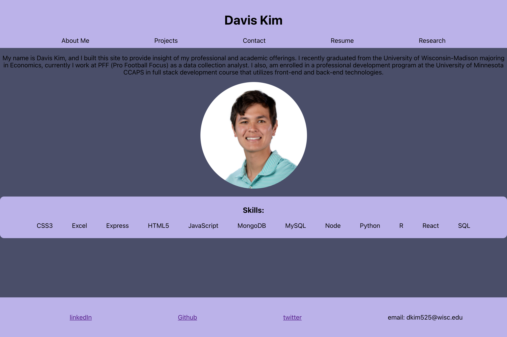

# React Portfolio
This is an updated portfolio that includes useful contact links, links to class assignments, and updated work. This portfolio is updated and built through react!

---

## **Table of Contents**

1. [Links](#Links)
2. [Technologies Used](#Technologies-Used)
3. [Installation](#Installation)

---

## **Links**

[GitHub repository](https://github.com/dkim525/Team-Profile)

---
## **Technologies Used**

* HTML
* CSS
* Javascript
* React
* Font-Awesome

## **Installation**
To run locally install needed modules then use npm start.